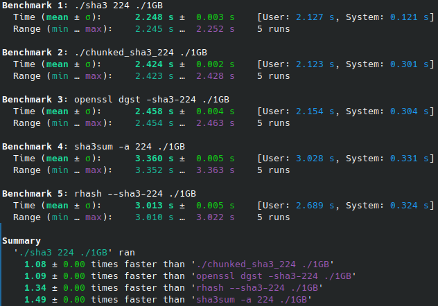
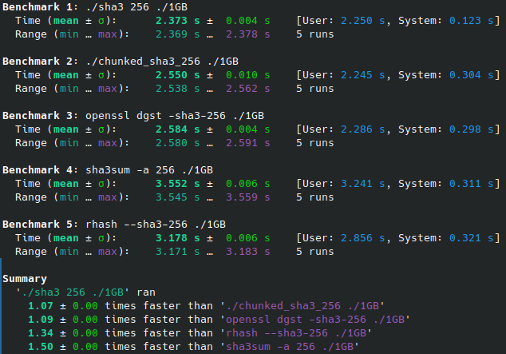
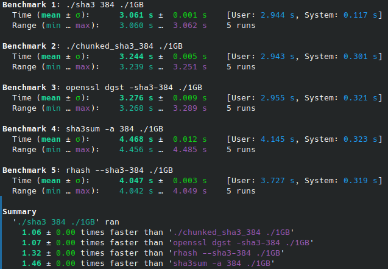
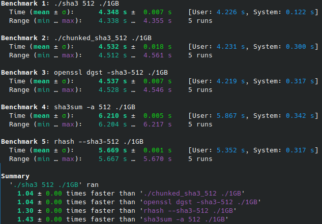
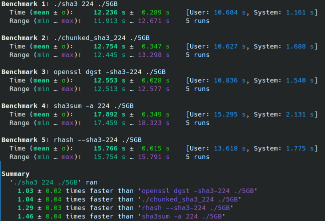

# SHA-3 benchmark

Below are the results of measuring the hashing speed of sha-3 files by utilities.
The task of each utility is to calculate the hash of the file as quickly as possible.

> This repository is represented by the `sha3` and `chunked_sha3` utilities

Benchmarking was performed using the [hyperfine](https://github.com/sharkdp/hyperfine) program.

## Environment

1. CPU: AMD Ryzen 5 4600H
2. Compiler: g++ 11.4.0
3. OS: kubuntu 22.04

> For greater accuracy, all third-party services were prohibited, and hyperfine was launched with additional parameter `--warmup 10`

## Calculating the hash for a 1GB file

### sha-3-224

### sha-3-256

### sha-3-384

### sha-3-512

> `sha3` shows the best results for all modes of hashing on 1GB file

## Calculating the hash for a 5GB file

### sha-3-224

### sha-3-256

### sha-3-384

### sha-3-512

> `sha3` shows the best results for all modes of hashing on 5GB file
